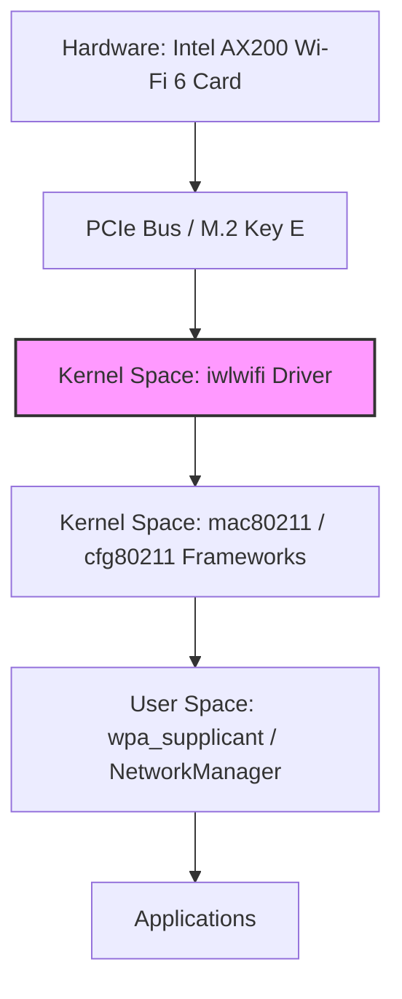
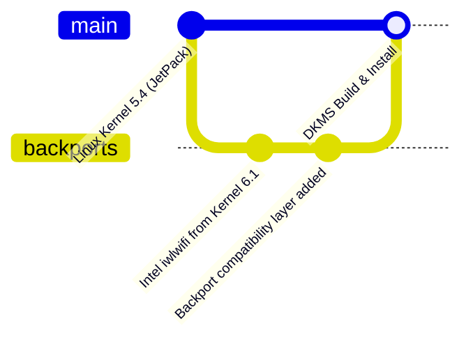
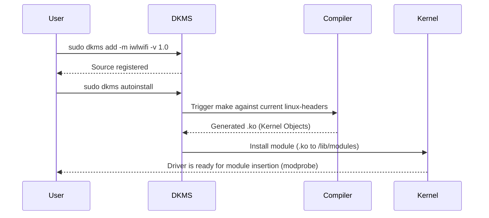

# Module 1: Wi-Fi 6 Driver Cross-Compilation

This module covers compiling the `backport-iwlwifi` driver specifically for a Jetson running JetPack, ensuring it operates correctly with modern Wi-Fi 6 hardware like the Intel AX200. We will also integrate it with DKMS (Dynamic Kernel Module Support) to persist across kernel upgrades.

## Architecture Stack



## Understanding DKMS and Backports

Since JetPack kernels are often slightly older or customized, they may lack out-of-the-box support for the newest Wi-Fi 6 cards. The Linux kernel community uses **backports** to bring newer networking subsystems back to older kernels.

**DKMS** allows drivers to be rebuilt automatically whenever a new kernel header package is installed.





## Step-by-Step Implementation

### 1. Preparing the Jetson Environment

First, install the required SDK and kernel headers. On a Jetson, kernel headers must precisely match the running JetPack version.

```bash
sudo apt update
sudo apt install build-essential bc dkms linux-headers-$(uname -r) git
```

### 2. Downloading Backport-iwlwifi

Intel officially provides Core Wi-Fi drivers. We fetch the backport source.

```bash
git clone https://git.kernel.org/pub/scm/linux/kernel/git/iwlwifi/backport-iwlwifi.git
cd backport-iwlwifi
```

### 3. Creating the DKMS Configuration

To make this DKMS-compatible, we create a `dkms.conf` file inside the `backport-iwlwifi` directory.

**dkms.conf:**
```ini
PACKAGE_NAME="iwlwifi"
PACKAGE_VERSION="1.0"
BUILT_MODULE_NAME[0]="iwlwifi"
DEST_MODULE_LOCATION[0]="/updates"
AUTOINSTALL="yes"
MAKE[0]="make defconfig-iwlwifi-public && make -j$(nproc)"
CLEAN="make clean"
```

### 4. Registering and Building with DKMS

Copy the source into `/usr/src` and register it with DKMS:

```bash
# Move source to DKMS tree
sudo cp -R . /usr/src/iwlwifi-1.0

# Add to DKMS tracking
sudo dkms add -m iwlwifi -v 1.0

# Build and install for the current kernel
sudo dkms autoinstall
```

### 5. Verifying the Installation

To verify that the newly built modules are inserted into the kernel tree:
```bash
sudo dkms status
lsmod | grep iwlwifi
```

## API and Kernel Interface

The `iwlwifi` driver exposes standard Network interfaces via the kernel's `nl80211` netlink API. User-space utilities like `iw` and `wpa_supplicant` use these netlink sockets to issue commands (e.g., scanning, associating) to the hardware.
