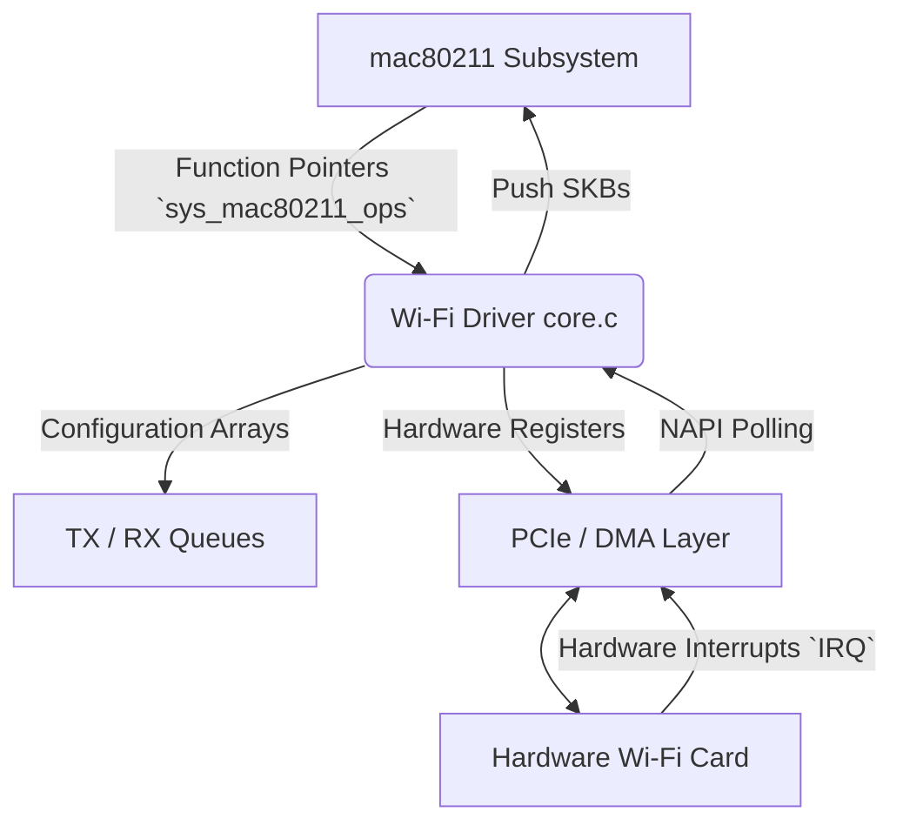
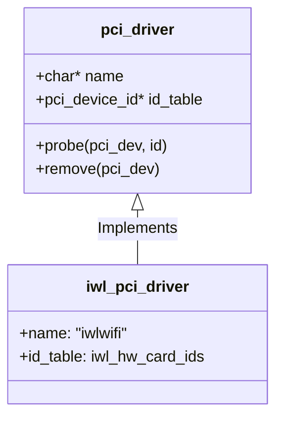
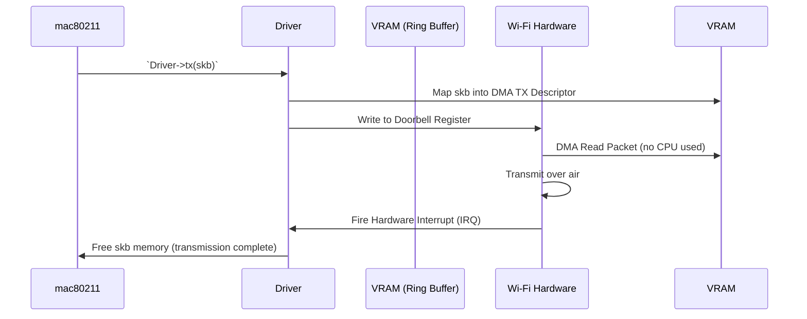
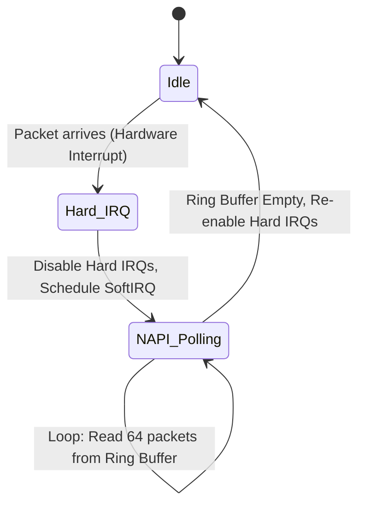

# Module 7: Wi-Fi Driver Architecture & Codebase Internals

How exactly is a Wi-Fi driver designed in Linux? What are the entry points, how does the kernel talk to the hardware, and what specific C structs should you look for?

This module breaks down the anatomy of a typical **SoftMAC Wi-Fi Driver** (like Intel's `iwlwifi` or Atheros's `ath9k`).

---

## 1. High-Level Driver Architecture

A Wi-Fi driver sits between the heavily abstracted **Linux Kernel Networking/mac80211 Stack** and the **Physical Hardware Bus (PCIe/USB)**.



## 2. Core Components of the Codebase

When you open a Wi-Fi driver directory in the Linux source (e.g., `drivers/net/wireless/intel/iwlwifi/`), you generally find files split into logical responsibilities.

### A. Bus Initialization (`pci.c` or `usb.c`)

This is where the kernel discovers the hardware. The driver registers itself with the Linux PCI subsystem.

```c
// Example: iwlwifi PCI driver registration
static struct pci_driver iwl_pci_driver = {
    .name = DRV_NAME,
    .id_table = iwl_hw_card_ids,  // List of supported Vendor/Device IDs (e.g. 0x8086 for Intel)
    .probe = iwl_pci_probe,       // Called when card is plugged in/booted
    .remove = iwl_pci_remove,     // Called when unplugged or module unloaded
};

module_pci_driver(iwl_pci_driver); // Tells the kernel: "I am a PCI driver"
```



**What `probe()` does**:
1. Checks if the specific hardware version is supported.
2. Maps the MMIO (Memory Mapped I/O) hardware registers into RAM so the CPU can read/write them.
3. Requests an Interrupt Request Line (IRQ) from the OS (`request_irq`).
4. Allocates DMA (Direct Memory Access) rings.

### B. Mac80211 Integration (`main.c` / `mac80211.c`)

The driver must tell the mac80211 subsystem "I am a Wi-Fi card, and here are the functions you call when you want to transmit data or change channels." This is done via a massive struct of function pointers called `ieee80211_ops` (or similar depending on kernel age).

```c
// The contract between the generic Linux Wi-Fi stack and specific hardware
static struct ieee80211_ops my_wifi_ops = {
    .tx = my_wifi_tx_packet,           // Called by kernel to send a Data/Management frame
    .config = my_wifi_config_mac,      // Change basic modes (Monitor, Station)
    .add_interface = my_wifi_add_if,   // Create wlan0 or mon0
    .set_channel = my_wifi_set_channel,// Tune the radio to 2.4 / 5 GHz
    .start = my_wifi_start_radio,      // Bring the radio out of deep sleep
};
```

When the user types `iw dev wlan0 set channel 6`, the kernel propagates that down to `my_wifi_set_channel()`, which writes a specific hexadecimal value to a specific hardware memory register to physically alter the PLL oscillator on the Wi-Fi chip.

### C. The Transport: DMA Ring Buffers (`tx.c` / `rx.c`)

Wi-Fi data happens too fast for the CPU to manually copy every byte. Drivers use **DMA (Direct Memory Access)**.

**The Design**:
1. The driver allocates a contiguous chunk of RAM (The Ring Buffer).
2. It gives the physical address of this RAM to the Wi-Fi card's hardware registers.
3. When `mac80211` wants to transmit an `sk_buff` (Socket Buffer - the universal Linux network packet struct), the driver translates the virtual address to a physical address, places it in the TX Ring, and effectively "rings a doorbell" register on the card.
4. The Wi-Fi hardware independently pulls the data from RAM and transmits it over the air.



### D. Interrupts and NAPI

When the Wi-Fi card receives a packet over the air, it does the reverse: it DMAs the data into the RX Ring Buffer and fires an Interrupt (IRQ) to tap the CPU on the shoulder.

**Nuance**: If a Wi-Fi 6 card is receiving 800 Mbps, firing an interrupt for every single packet would freeze the CPU entirely (Interrupt Storm). 
Linux networking solves this with **NAPI (New API)**:



1. The hardware fires *one* interrupt.
2. The driver disables further interrupts.
3. The driver transitions into a software polling state (`napi_poll`), rapidly pulling hundreds of packets off the generic ring buffer and pushing them up to `mac80211`.
4. When the ring is empty, it turns hardware interrupts back on.

## 3. Firmware Loading (`fw.c`)

Most modern Wi-Fi chips (Intel AX200, Broadcom) do not permanently store their operating system. The Linux driver must upload a binary blob (Firmware) to the chip's internal RAM every time you boot.

```c
// Example pseudo-flow for triggering firmware load
request_firmware(&fw_blob, "iwlwifi-cc-a0-72.ucode", device);

// Write firmware blob into the card's specific memory address via DMA
my_wifi_load_firmware_chunk_dma(fw_blob->data, fw_blob->size);

// Tell the card's embedded microcontroller to boot
write_register(CARD_BOOT_REGISTER, 1);
```
If this fails, the driver aborts `probe()`, which is why you see `"Direct firmware load failed"` in `dmesg`.

## Summary Cheat Sheet mapping Code to Concepts

| Linux Networking Concept | Wi-Fi Driver Equivalent | C File/Struct you usually look for |
| :--- | :--- | :--- |
| **Bus Detection** | PCIe `id_table` matching | `pci.c`, `struct pci_driver` |
| **MAC API** | Function Hooks for userspace | `mac80211.c`, `struct ieee80211_ops` |
| **Memory Buffer** | `sk_buff` (SKB) | Used aggressively in `tx.c`, `rx.c` |
| **Interrupt Handling** | Top-half IRQ / Bottom-half Tasklets | `isr.c` (Interrupt Service Routine), `napi_struct` |
| **Rate Scaling** | Minstrel / Rate Control | Often part of `mac80211` but configured in driver `tx` queues. |
