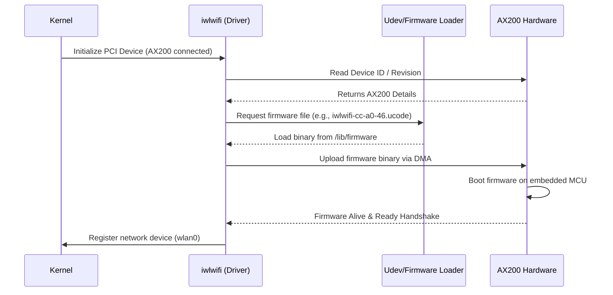

# Module 2: Firmware Integration (Intel AX200)

Even with the correct kernel module (`iwlwifi` compiled in Module 1), the Wi-Fi card cannot initialize without the correct closed-source **Firmware** provided by Intel. 

## The Hardware-Software Handshake

The driver provides the rules of engagement (logic), but the firmware is the actual binary code that runs on the embedded microcontroller inside the AX200 chip itself. 



## The Linux Firmware Subsystem Flow

```mermaid
graph LR
    A[Driver calls `request_firmware()`] --> B[Kernel creates sysfs node]
    B --> C[Kernel broadcasts uevent]
    C --> D[Udev daemon wakes up]
    D --> E{File in /lib/firmware/?}
    E -->|Yes| F[Udev writes blob to sysfs]
    E -->|No| G[Driver Probe Fails -2]
    F --> H[Driver DMAs to AX200]
    
    style E fill:#f96,stroke:#333
    style H fill:#bbf,stroke:#333
```

## Applying the Firmware

Intel distributes the firmware directly at `git.kernel.org`.

### 1. Download Firmware Files

```bash
git clone git://git.kernel.org/pub/scm/linux/kernel/git/firmware/linux-firmware.git
```

### 2. Copy the Proper UCODE file

For AX200, the necessary files typically match `iwlwifi-cc-a0-*.ucode`.
We need to copy these over to the root filesystem's firmware repository:

```bash
sudo cp linux-firmware/iwlwifi-cc-a0-*.ucode /lib/firmware/
```

*Note: Ensure the file permissions are correct (readable by the kernel).*

### 3. Reloading the Driver

You can either reboot the Jetson or manually remove and re-insert the driver module to force a firmware reload:

```bash
sudo modprobe -r iwlwifi
sudo modprobe iwlwifi
```

### 4. Verification

To verify the firmware loaded successfully and the driver recognized it, utilize `dmesg`. This confirms the hardware-to-software handshake.

```bash
dmesg | grep iwlwifi
```

**Expected Successful Output:**
```text
[   12.345678] iwlwifi 0000:01:00.0: loaded firmware version 46.30633af3.0 cc-a0-46.ucode op_mode iwlmvm
[   12.356789] iwlwifi 0000:01:00.0: Detected Intel(R) Wi-Fi 6 AX200 160MHz, REV=0x340
[   12.456789] iwlwifi 0000:01:00.0: base HW address: 00:11:22:33:44:55
```

If it fails to find the firmware, it will output:
```text
[   12.345678] iwlwifi 0000:01:00.0: Direct firmware load for iwlwifi-cc-a0-46.ucode failed with error -2
```
If you encounter this, verify that the required `.ucode` file exactly matches the version requested in `dmesg` and exists inside `/lib/firmware`.
