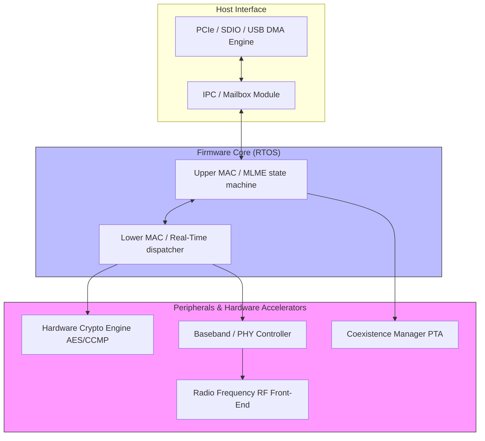
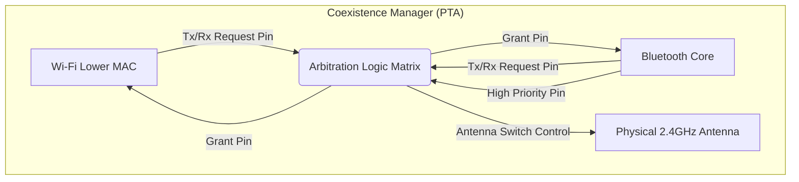

# Module 8: Firmware Architecture & Design Internals

While the Linux Driver (Module 7) abstracts the hardware for the operating system, the **Firmware** is the actual software executing on the embedded microcontroller (MCU) inside the Wi-Fi/Bluetooth chip itself (e.g., an ARM Cortex-R or Andes RISC-V core inside the Intel AX200). 

Designing firmware for wireless communication is vastly different from writing user-space Linux applications. It requires strict adherence to **Hard Real-Time** constraints and hyper-optimized power management.

---

## 1. The Anatomy of Wireless Firmware

A modern Wi-Fi SoC (System on Chip) runs a tiny, highly-specialized Real-Time Operating System (RTOS). The firmware is typically broken down into distinct layers/modules.

## 2. Choosing and Designing Firmware Modules

When a firmware architect designs the software for a new Wi-Fi 6 or BLE chip, they must implement specific conceptual modules. How these modules are designed dictates if the firmware is categorized as **FullMAC** or **SoftMAC** (as discussed in Module 5).

### A. The Lower MAC (Real-Time Dispatcher)
This is the most critical module. It handles tasks that *must* happen within microseconds.
* **Design Constraint (SIFS)**: In Wi-Fi, when you receive a data frame, you must reply with an ACK frame exactly within the Short Interframe Space (SIFS), which is **16 microseconds** for 802.11ac/ax. 

```mermaid
gantt
    title Hard Real-Time Constraint (802.11 SIFS) - Scaled visually
    dateFormat  s
    axisFormat %S
    
    section On-Air
    Rx Data Frame (1500 bytes) :a1, 0, 100s
    SIFS (Silent Period)       :a2, after a1, 16s
    Tx ACK Frame               :a3, after a2, 40s
    
    section Lower MAC
    Hardware CRC Check         :b1, after a1, 4s
    Lookup Address & Prepare   :b2, after b1, 6s
    Arm Tx Crypto Engine       :b3, after b2, 4s
    Tx Trigger                 :b4, after a2, 0s
```

* **Implementation**: The Lower MAC cannot rely on RTOS task-switching (which takes too long). It is usually implemented as a highly optimized Interrupt Service Routine (ISR) executing out of TCM (Tightly Coupled Memory, meaning zero cache-misses allowed) or offloaded entirely to a hardware state-machine.

### B. The Upper MAC (MLME - MAC Sublayer Management Entity)
This module handles state machines that don't have strict microsecond deadlines: Scanning, Association handshakes, and roaming.
* **Design Choice**: In a **SoftMAC** architecture (Intel `iwlwifi`), the Upper MAC is stripped out of the firmware and pushed to the Linux kernel (`mac80211`). 
* **Design Choice**: In a **FullMAC** architecture (Broadcom `brcmfmac` found in iPhones/IoT), the Upper MAC is kept inside the firmware. This reduces the load on the host CPU but makes the firmware much larger and harder for developers to debug/modify.

### C. The Hardware Crypto Engine
Wi-Fi 6 data is encrypted with AES-CCMP. Doing this in firmware software (CPU) is impossible at Gigabit speeds.
* **Design Pattern**: The firmware maintains an "Encryption Key Table" in hardware registers. When the Lower MAC decides to transmit a packet, it simply passes a DMA pointer to the Hardware Crypto Engine, telling it "Encrypt this using Key Index 2," and the hardware does it inline as the bits fly to the radio.

### D. The Coexistence Manager (PTA - Packet Traffic Arbitration)
Because Wi-Fi and Bluetooth share the exact same 2.4 GHz antenna, they will destroy each other's signals if they transmit simultaneously.
* **Design**: The firmware implements a PTA (Packet Traffic Arbitration) module. Bluetooth and Wi-Fi assert priority pins (e.g., "I am receiving an important BLE connection request"). The PTA uses a scheduling matrix to decide whether to pause the Wi-Fi transmission for 2 milliseconds to let the Bluetooth packet go out.

## 3. Advanced Firmware Design Constraints

### 1. Memory Management (No `malloc`)
Wireless firmware is severely memory constrained (often < 1MB of SRAM total).
* **Pattern**: Firmware almost never uses dynamic memory allocation (`malloc`/`free`) to avoid memory fragmentation and unpredictable execution times.
* **Solution**: It uses statically allocated **Memory Pools** or **Ring Buffers**. If a packet arrives and the buffer is full, it is instantly dropped at the hardware level.

### 2. Power Management (TWT and Deep Sleep)
Wi-Fi 6 introduces **Target Wake Time (TWT)**. 
IoT devices want to sleep to save battery. The firmware's RTOS must negotiate a sleep schedule with the Access Point (e.g., "I will turn off my radio and CPU for exactly 500ms, please buffer my packets").
* **Design**: The firmware programs an ultra-low-power Hardware RTC (Real-Time Clock) to fire an interrupt in exactly 500ms. It then shuts off power to the main Cortex-R CPU and the Radio. When the RTC fires, the Boot ROM rapidly restores the RTOS state and wakes the radio just in time to catch the AP's beacon.

## Summary: Firmware Engineer's Checklist

If you are writing or modding firmware (like the `nexmon` project for Broadcom chips), you must consider:
1. **Interrupt Latency**: Can my code execute in < 10 microseconds? If not, it belongs in a lower-priority RTOS thread, not an ISR.
2. **Memory Location**: Is this code in Flash (slow, cache-dependent) or SRAM/TCM (fast, predictable)?
3. **Hardware Offload**: Am I trying to parse bits manually? I should configure the Baseband hardware to do it instead.
