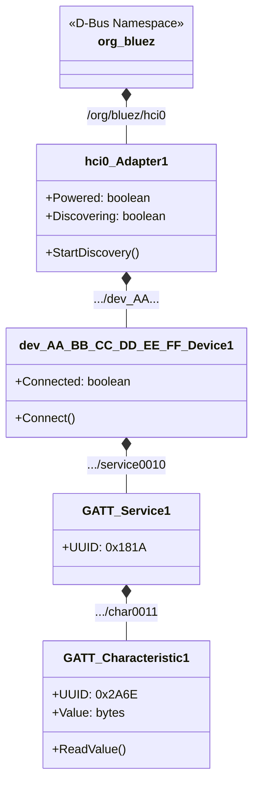

# Module 3: BLE Control Application via BlueZ

This module covers the implementation of a BLE (Bluetooth Low Energy) control application using the Linux **BlueZ** stack. 
Specifically, we will build a GATT client in Python utilizing `bleak` and D-Bus APIs to scan for nearby environmental BLE sensors and read their data.

## The BlueZ Stack Architecture

```mermaid
graph TD
    A[Python Application] -->|D-Bus API| B[bluetoothd (BlueZ Daemon)]
    B -->|HCI Sockets| C[Linux Kernel: Bluetooth Subsystem]
    C -->|HCI UART / USB| D[Hardware: AX200 Bluetooth Radio]
    
    style B fill:#bbf,stroke:#333,stroke-width:2px;
```

On Linux, interaction with Bluetooth is primarily abstracted over D-Bus objects exposed by the `bluetoothd` daemon.



Instead of manually writing raw D-Bus calls, we use specialized libraries like `Bleak` which wrap these D-Bus calls gracefully for modern async Python usage.

## Python Application Stack

The application will:
1. Initialize the Bluetooth Adapter.
2. Put the adapter in scanning mode.
3. Discover devices with specific Environmental Sensor Service UUIDs (e.g. `0000181A-0000-1000-8000-00805f9b34fb`).
4. Read the Temperature and Humidity Characteristics.

### Environmental Sensing Service

* **Service UUID**: `0x181A`
* **Temperature Characteristic**: `0x2A6E` (Resolution: 0.01 degrees Celsius)
* **Humidity Characteristic**: `0x2A6F` (Resolution: 0.01 percent)

## Running the Code

### Dependencies

Install the bleak library which handles the BlueZ DBus communication:
```bash
pip3 install bleak
```

### Execution

```bash
python3 ble_scanner.py
```
