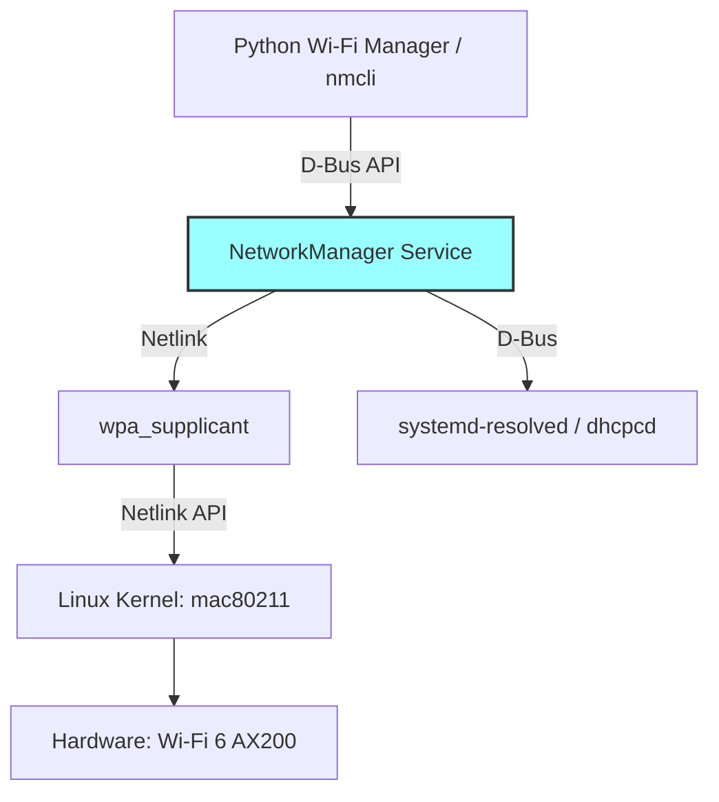
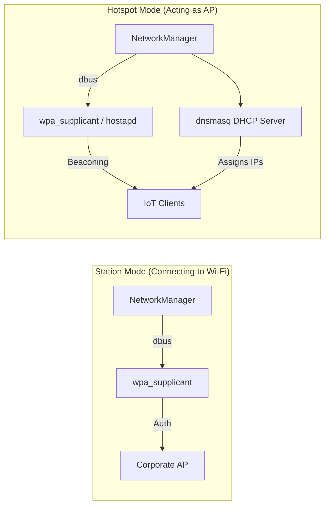
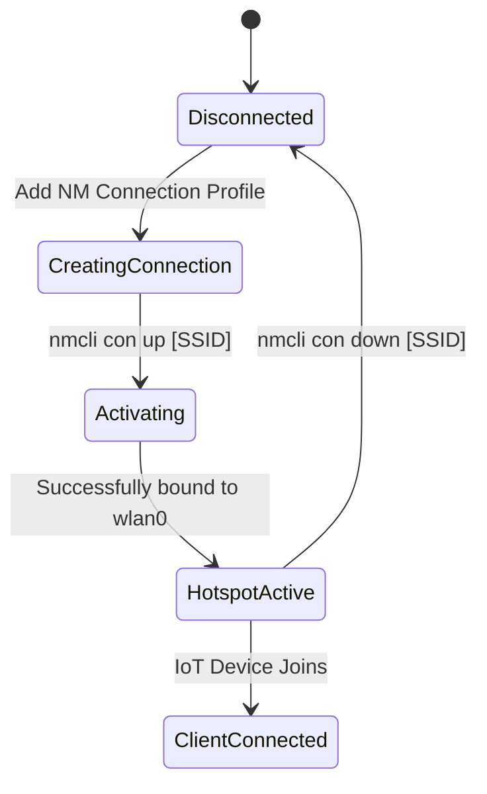

# Module 4: Wi-Fi 6 Control Application

This module involves managing Wi-Fi 6 capabilities programmatically using **NetworkManager**. It demonstrates how to utilize `nmcli` and Python's subprocesses (or python-networkmanager) to manage Access Points (Hotspots) and Station Mode (connecting to Wi-Fi) on Linux.

## The NetworkManager Stack



### Modes of Operation under NetworkManager

When `nmcli` sets up a connection, NetworkManager internally configures the wireless daemons:



## State Transitions (Hotspot Flow)



## Setup and Capabilities

By configuring NetworkManager we can spin up a Wi-Fi 6 AP (if hostapd and wpa_supplicant support it and the hardware is capable of AP mode).

### Pre-Requisites

Make sure NetworkManager is managing the interface, and `dnsmasq` is available to provide DHCP addresses to IoT clients that join the hotspot.

```bash
sudo apt install network-manager dnsmasq
```

## Python Control Application

The script `wifi_manager.py` uses `subprocess` to control `nmcli` directly. This approach is highly robust because it utilizes the native NetworkManager CLI, meaning the states mirror exactly what an OS user sees.

### Features
1. **Connect to a Router (Station Mode)**: Links the device to an existing Network.
2. **Setup Wi-Fi Hotspot (AP Mode)**: Creates a dedicated 802.11 Wi-Fi hotspot for IoT devices to join.

### Executing

```bash
# To run the script and spawn a hotspot:
python3 wifi_manager.py start-hotspot MyIoT_Network SecretPassword123

# To stop the hotspot
python3 wifi_manager.py stop-hotspot MyIoT_Network
```

NetworkManager handles all behind-the-scenes configuration, including AP mode invocation on `wlan0`, setting the BSSID, and bringing up the DHCP server on a virtual subnet (typically `10.42.0.1/24`).
