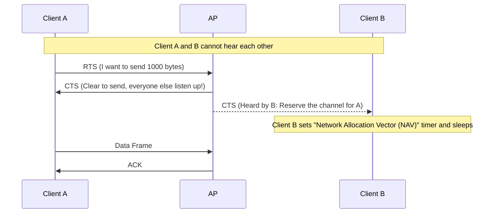
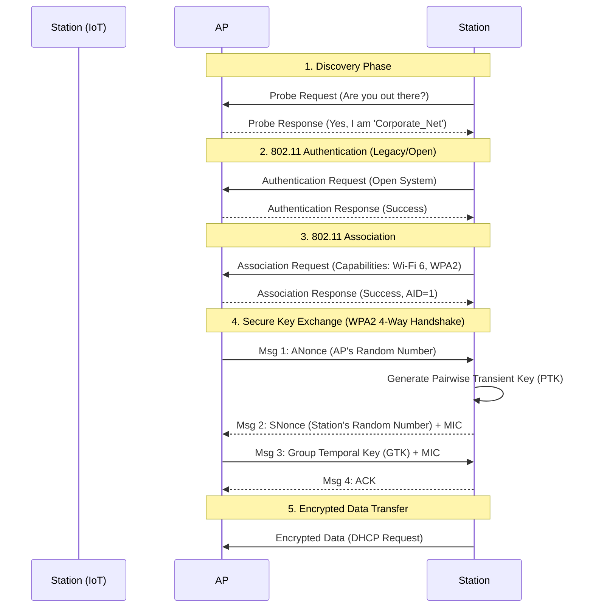
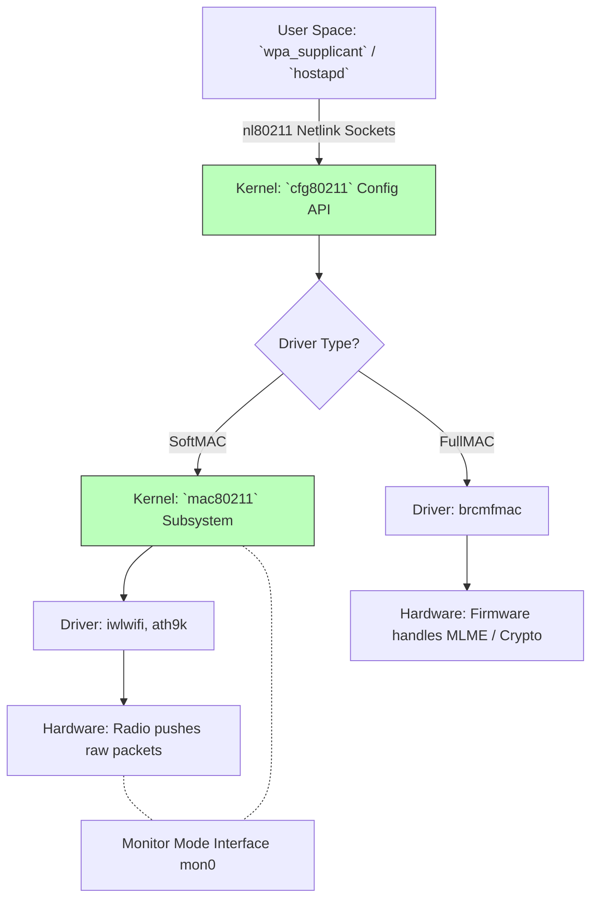

# Module 5: Wi-Fi Stack and Protocols (802.11) Deep Dive

To master Wi-Fi 6 development on Linux and truly understand what happens over the air and inside the kernel, an engineer must grasp the nuances of the **IEEE 802.11 Protocols** and the **Linux 802.11 Subsystem**.

---

## 1. IEEE 802.11 Protocol Architecture & Nuances

Wi-Fi resides at the bottom two layers of the OSI model: **Physical (PHY)** and **Data Link (MAC)**. 

Unlike wired Ethernet which is strictly managed by switches, Wi-Fi is a shared, half-duplex medium. Everyone hears everyone else, and only one device can transmit on the same channel at a time.

### The Problem of Collisions (CSMA/CA)

Because Wi-Fi relies on radio waves, radios cannot transmit and receive simultaneously to detect collisions (like Ethernet's CSMA/CD). Instead, Wi-Fi uses **CSMA/CA (Carrier Sense Multiple Access with Collision Avoidance)**.

1. **Carrier Sense**: Listen to the channel. Is someone transmitting?
2. **Collision Avoidance**: If busy, wait for a random backoff period before trying again.

### Hidden Node Problem & RTS/CTS

**Nuance**: Imagine an Access Point (AP) in the middle, and two clients (A and B) on opposite sides. A and B are too far apart to hear each other, but both can hear the AP. If both transmit simultaneously, their signals will collide at the AP, destroying the data.

To solve this, 802.11 uses **Control Frames**: RTS (Request To Send) and CTS (Clear To Send).



## 2. Anatomy of 802.11 Frames

Every Wi-Fi packet is an 802.11 "Frame". Unlike Ethernet frames which have two MAC addresses (Source, Destination), 802.11 frames typically rely on **Three or Four MAC addresses** (Source, Destination, Transmitter, Receiver) to route data transparently through the AP.

### Types of 802.11 Frames

1. **Management Frames**: Establish and maintain the connection. (Not encrypted originally, which led to de-authentication attacks. Protected Management Frames (PMF) solve this in WPA3).
   * **Beacons**: The AP's heartbeat (every ~100ms) advertising SSID and capabilities.
   * **Probe Request/Response**: Active scanning by clients.
2. **Control Frames**: Delivery assistance.
   * **ACK**: Sent synchronously after every successful data reception. If A sends data and doesn't get an ACK, A assumes a collision and retransmits.
3. **Data Frames**: Carries IP/TCP payloads.

### The Connection State Machine (The "Handshake")

Joining a Wi-Fi network requires a strict sequence of Management frames before Data can flow.



## 3. Demystifying the Linux 802.11 Stack

Linux provides an incredibly complex, layered architecture to abstract various hardware vendor implementations.



### FullMAC vs SoftMAC (The Critical Distinction)

**Nuance**: Hardware vendors write their firmware in two distinct philosophies:
1. **FullMAC**: The Wi-Fi chip's internal firmware handles everything—scanning, joining the AP, encryption, timing, and handshakes. The Linux kernel just sends/receives raw Ethernet packets. (Common in mobile/IoT chips like Broadcom `brcmfmac`). Very restrictive for developers.
2. **SoftMAC**: The Wi-Fi chip is just a dumb radio. The Linux kernel (`mac80211`) handles all the state machines, encryption, and routing. (Common in Intel/Atheros `iwlwifi`, `ath9k`). Highly flexible, allows **Monitor Mode** and **Packet Injection**.

**Memory Hook**: If you want to do security research (packet injection, monitor mode), you *must* use a SoftMAC architecture because the kernel has full control over the 802.11 headers.

## 4. Practical Usage & Network Forensics

To interact natively with `nl80211` and bypass NetworkManager:

### 1. `iw` - The Swiss Army Knife
```bash
# See if your card supports Monitor Mode or AP mode
iw list | grep -A 10 "Supported interface modes:"

# Check actual link metrics (RSSI, TX bitrates)
iw dev wlan0 link
```

### 2. Monitor Mode & Promiscuous Sniffing
If you bring an interface up in monitor mode, you aren't authenticated to an AP, but you can hear *all* 802.11 frames in the air around you on a specific channel.

```bash
# Tear down managed interface and create a monitor interface
sudo ip link set wlan0 down
sudo iw dev wlan0 set type monitor
sudo ip link set wlan0 up

# Tune the radio to channel 6 (2.4GHz) or 36 (5GHz)
sudo iw dev wlan0 set channel 6

# Dump pure 802.11 frames to Wireshark
sudo tcpdump -i wlan0 -s 0 -w wlan_capture.pcap
```
