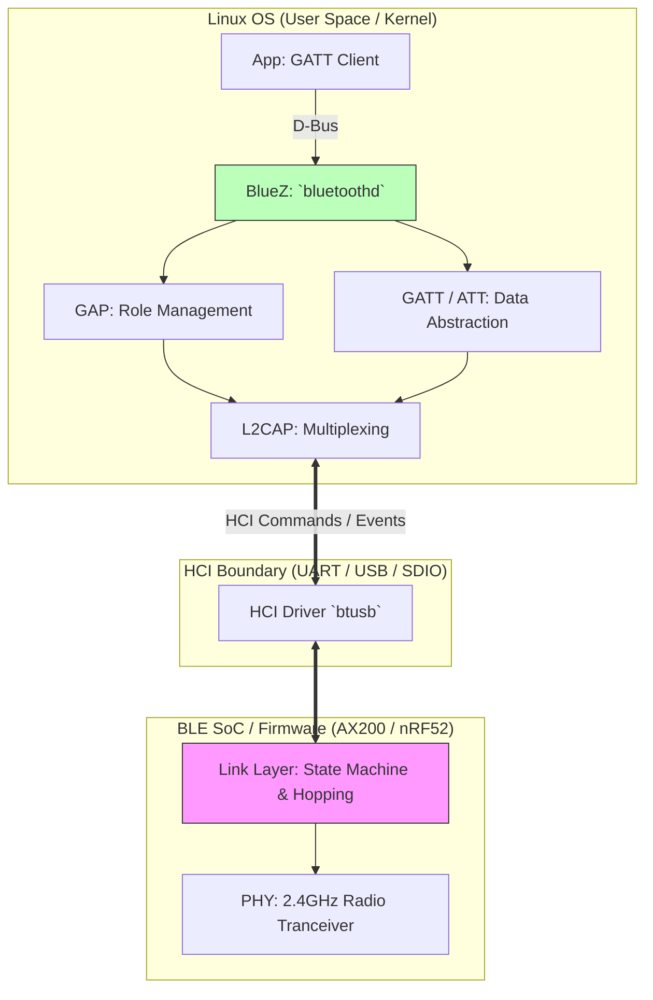
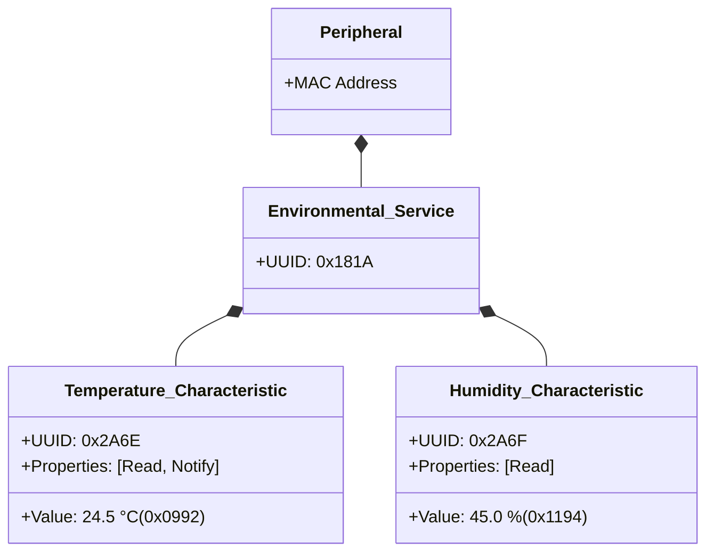

# Module 6: Bluetooth & BLE Stack and Protocols Deep Dive

This module shifts focus to the **Bluetooth** ecosystem, exploring the nuances of Bluetooth Low Energy (BLE), its split architecture, and how Linux models it via the **BlueZ** stack.

---

## 1. The Physics: Wi-Fi vs. Bluetooth

Both Wi-Fi and Bluetooth operate in the unlicensed **2.4 GHz ISM band**. 

**Nuance**: Wi-Fi camps on a single wide "Channel" (e.g., 20MHz wide) and stays there. This is susceptible to localized noise. 
Bluetooth solves interference by using **FHSS (Frequency Hopping Spread Spectrum)**. It slices the 2.4GHz band into 40 small channels (2MHz each) and rapid-fires hops between them (up to 1600 times a second), dodging interference in pseudo-random patterns known to both the sender and receiver.

## 2. BLE Stack Split Architecture: Host vs Controller

Unlike Wi-Fi which usually presents a single monolithic interface to the OS, Bluetooth explicitly mandates a hardware/software split defined by the **HCI (Host Controller Interface)**.



* **The Controller**: The physical radio chip and its closed-source embedded firmware. It handles the raw physics, encryption, and millisecond-accurate frequency hopping.
* **The Host**: The software stack running on the main CPU (e.g., Mac, iOS, or Linux BlueZ). It handles the logical protocols (GATT, L2CAP).

## 3. BLE Operational States (GAP)

Devices in BLE are heavily asymmetrical to save power. 

1. **Broadcaster / Peripheral** (The Sensor): Usually asleep. Wakes up periodically to blindly broadcast "Advertising Packets" into the void on 3 dedicated advertising channels (Channels 37, 38, 39).
2. **Observer / Central** (The Linux Gateway): Actively scans these 3 channels listening for advertisements. When it hears one, it can initiate a Connection Request.

```mermaid
sequenceDiagram
    participant Peripheral (e.g., Temp Sensor)
    participant Central (e.g., Linux Gateway)
    
    Note over Peripheral: Wakes up every 500ms
    Peripheral->>Central: ADV_IND (I am unassigned Temp Sensor)
    Central-->>Peripheral: SCAN_REQ (Tell me more about yourself)
    Peripheral->>Central: SCAN_RSP (My name is "EnvSens_01")
    Central-->>Peripheral: CONNECT_REQ (Let's form a dedicated link)
    
    Note over Peripheral, Central: Link is now formed. FHSS begins across 37 Data Channels.
```

## 4. Understanding GATT (Generic Attribute Profile)

Once connected, data is structured using GATT. This is the **most crucial concept** for BLE application developers. Think of GATT like a strict JSON database schema stored on the Peripheral.

**The Hierarchy**:
1. **Profile**: A theoretical standard (e.g., "Heart Rate Profile").
2. **Service**: A collection of related data (e.g., "Heart Rate Service", UUID `0x180D`).
3. **Characteristic**: A specific data point inside a Service (e.g., "Heart Rate Measurement", UUID `0x2A37`). Characteristics have a Value, Properties (Read, Write, Notify), and Descriptors.



**Nuance (Handles vs UUIDs)**: UUIDs are heavily 128-bit identifiers (expensive to transmit over the air). When heavily constrained BLE devices connect, they do a "Service Discovery" phase where the Central asks the Peripheral to map its 128-bit UUIDs to 16-bit **Handles** (e.g., `Handle 0x001A` = Temp Characteristic). Future reads/writes just use the 2-byte Handle to save bandwidth.

## 5. Deep Linux Practical Tooling

While `bluetoothctl` is for users, developers need lower-level inspection.

### 1. `btmon` (The Wireshark of HCI)
Because the "Host" (Linux) communicates with the "Controller" (Hardware) via HCI over a local bus (USB), Linux can intercept every command and event. 
Running `sudo btmon` intercepts this traffic locally, bypassing the need for an expensive $1,000 wireless Bluetooth sniffer.

```text
# Output from btmon during a connection:
> HCI Event: Command Complete (0x0e) plen 4
      LE Create Connection (0x20|0x000d) ncmd 1
< HCI Command: LE Read Remote Used Features (0x08|0x0016) plen 2
> HCI Event: LE Meta Event (0x3e) plen 14
      LE Read Remote Used Features (0x04)
        Status: Success (0x00)
```

### 2. D-Bus Interaction via `busctl` or `qdbus`
Because `bluetoothd` models everything as D-Bus objects, developers can script Wi-Fi without explicit Python wrappers (like `bleak`).
```bash
# See the D-Bus tree representing the Bluetooth adapter
busctl tree org.bluez

# Example Output snippet:
# └─/org/bluez
#   └─/org/bluez/hci0
#     └─/org/bluez/hci0/dev_AA_BB_CC_DD_EE_FF
```
This is why modern Linux apps don't talk to `HCI0` natively anymore; they invoke methods on `/org/bluez/hci0` via D-Bus IPC to avoid hardware lock contention.
