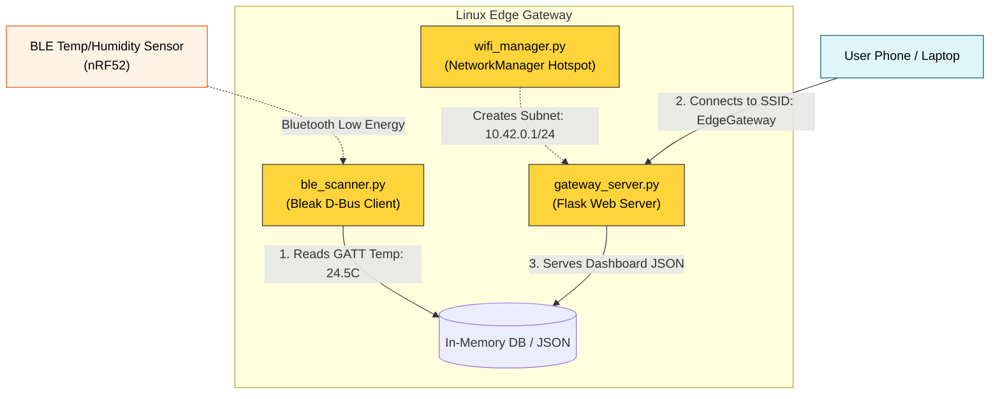

# Module 7: Capstone - The IoT Edge Gateway Pipeline

Now that we understand the Linux network stack all the way from the PCIe subsystem and Wi-Fi drivers, up to the DBus Application APIs, it's time to build a real-world **Application Enablement Pipeline**.

The goal of this project is to turn your Jetson/Linux device into an intelligent **Edge Gateway**. 

## The Project Objective

Your Gateway will live entirely off-grid (no internet required). It will:
1. Spin up a local **Wi-Fi 6 Hotspot** and issue local IP addresses.
2. Bridge to the physical world by continuously scanning the room for **BLE sensors** and pulling their Temperature/Humidity data.
3. Host a lightweight **Local Web Dashboard** (HTTP) on the Wi-Fi subnet so that any Phone/Laptop joining the hotspot can view the live sensor data.

---

## 🏗 The Gateway Architecture



---

## Step 1: Combining the Scripts (The Orchestrator)

We will write a `gateway_server.py` file that orchestrates the Wi-Fi setup, kicks off the Bluetooth scanner in the background, and hosts the Flask web app.

### Pre-requisites
You'll need a micro-web framework like Flask to host the local UI.
```bash
pip install flask bleak
```

### The Orchestrator Logic (`gateway_server.py`)
This ties everything together. See the code block below for the structure.

```python
import threading
import subprocess
from flask import Flask, jsonify
from ble_scanner import scan_and_read_sensors # From Module 3
import time

app = Flask(__name__)

# Shared state between BLE background thread and Flask Web thread
sensor_data = {
    "temperature_c": None,
    "humidity_pct": None,
    "last_updated": "Never"
}

def start_wifi_hotspot():
    """Module 4 Integration: Spin up the Local Subnet"""
    print("[Gateway] Spinning up Local Wi-Fi 6 AP...")
    subprocess.run(["nmcli", "device", "wifi", "hotspot", "ifname", "wlan0", "ssid", "Edge_IoT_Gateway", "password", "SuperSecretKey123"])
    print("[Gateway] Subnet 10.42.0.1 established! Users can connect.")

def background_ble_poller():
    """Module 3 Integration: Periodically poll GATT devices"""
    import asyncio
    while True:
        print("[BLE] Polling Sensors...")
        try:
            # We mock the return for brevity, but you'd use your bleak client here
            # temp, hum = asyncio.run(scan_and_read_sensors())
            
            sensor_data["temperature_c"] = 24.5 # Example
            sensor_data["humidity_pct"] = 55.0  # Example
            sensor_data["last_updated"] = time.strftime("%H:%M:%S")
        except Exception as e:
            print(f"[BLE Error]: {e}")
        time.sleep(10) # Poll every 10 seconds

@app.route("/")
def dashboard():
    """The Local UI"""
    html = f"""
    <html>
        <body style="font-family: Arial; text-align: center; margin-top: 50px;">
            <h1>Edge Gateway Dashboard</h1>
            <h3>Live Environmental Data</h3>
            <h2 style="color: red;">Temperature: {sensor_data['temperature_c']} &deg;C</h2>
            <h2 style="color: blue;">Humidity: {sensor_data['humidity_pct']} %</h2>
            <p>Last Read from BLE: {sensor_data['last_updated']}</p>
        </body>
    </html>
    """
    return html

@app.route("/api/data")
def api():
    """For edge products polling programmatically"""
    return jsonify(sensor_data)

if __name__ == "__main__":
    start_wifi_hotspot()
    
    # Kick off the BLE scanner in the background so it doesn't block the web server
    threading.Thread(target=background_ble_poller, daemon=True).start()
    
    # Start the local UI on the newly created hotspot subnet
    # 0.0.0.0 binds to all interfaces, including 10.42.0.1
    print("[Gateway] Starting Local Web Dashboard on http://10.42.0.1:5000")
    app.run(host="0.0.0.0", port=5000)
```

---

## Step 2: The Flow of Execution

Once you run `sudo python3 gateway_server.py`:
1. **NetworkManager** takes over `wlan0` and starts broadcasting the SSID `Edge_IoT_Gateway`.
2. A background Python thread spins up `bluetoothd` (via Bleak DBus) and begins scanning for Service UUID `0x181A` in the surrounding room space.
3. The Flask Webserver binds to port 5000.
4. You take your iPhone, connect to `Edge_IoT_Gateway` via Wi-Fi.
5. You open Safari and type `http://10.42.0.1:5000` (The default NetworkManager Hotspot IP).
6. **Result**: Your phone displays the bleeding-edge Bluetooth sensor data that was just pulled across the room, hosted entirely locally without the Gateway ever touching the actual Internet!

This is the exact architecture pattern used by industrial IoT hubs, Local smart-home hubs (like Home Assistant), and configuring drones in the field.
