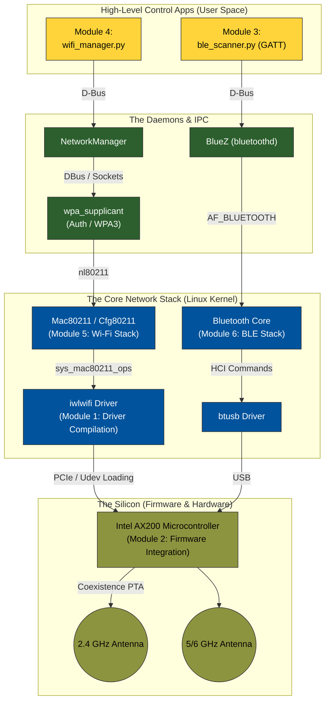

# Network Stack Development (Wi-Fi 6 & BLE)

Welcome to the comprehensive guide on modern Linux Wireless Networking and Driver Integration. This repository is structured as a series of **highly-visual, deep-dive learning modules** designed to take you from configuring high-level IoT applications down to compiling bare-metal firmware architectures.

Whether you are configuring a custom Jetson JetPack environment or just want to understand how packets fly through the air, this guide provides the architecture and the code.

## The Big Picture: How It All Connects

Here is the entire stack visualized—from your Python application down to the physical 2.4/5GHz antennas.

---

## 📚 Learning Modules

Follow the modules in order to build the stack from the ground up, or jump into specific architectural deep-dives.

| Module | Focus Area | Description |
| :--- | :--- | :--- |
| **[Module 1: Driver Setup](./01_WiFi6_Driver_Compilation/)** | Kernel Space | Compiling `backport-iwlwifi` for JetPack, DKMS integration, and exploring the C driver (`pci.c`, Mac80211 integration, DMA Rings). |
| **[Module 2: Firmware & RTOS](./02_Firmware_Integration/)** | Bare-Metal | Exploring Udev firmware loading protocols, the Hardware-Software Handshake, and Hard Real-Time design constraints. |
| **[Module 3: BLE Apps](./03_BLE_Control_App/)** | User Space | Writing a Python GATT client with `bleak`, DBus object hierarchies, and handling Environmental Sensor services. |
| **[Module 4: Wi-Fi Apps](./04_WiFi6_Control_App/)** | User Space | Writing a Python script using `nmcli` to dynamically control NetworkManager for Station (Client) and AP (Hotspot) modes. |
| **[Module 5: Wi-Fi Protocols](./05_WiFi_Stack_And_Protocols/)** | Theory / Forensics| CSMA/CA, 802.11 Frame analysis, FullMAC vs SoftMAC, and using `iw` and monitor mode for packet interception. |
| **[Module 6: BLE Protocols](./06_Bluetooth_Stack_And_Protocols/)** | Theory / Forensics| The BLE host-controller split, GAP States, GATT Handles, and sniffing local packets using `btmon`. |

## Key Takeaways
1. **D-Bus is King**: Modern Linux completely abstracts radio hardware away from User Space via IPC (NetworkManager and BlueZ).
2. **Mac80211 vs Firmware**: The line between what the Driver does and what the Firmware does shifts depending on the vendor.
3. **Coexistence**: Wi-Fi and Bluetooth are constantly fighting for the same 2.4GHz airspace. Firmware-level Packet Arbitrators solve this silently.

Enjoy exploring the stack!
